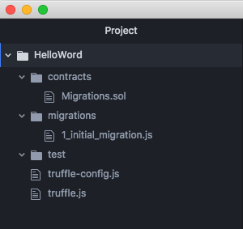

# Truffle-HelloWord

## truffle 開發智能合約的第一步

安裝truffle開發環境，建置智能合約部署。
並且實作傳送Ether function。
###環境版本
* node v8.9.3
* npm 5.6.0

###套件介紹
* truffle: 提供智能合約開發框架，包含測試以及部署。
* testrpc: 區塊鏈模擬環境。

### 安裝開發環境

安裝testrpc, truffle

```
$ npm install -g ethereumjs-testrpc 

```
執行區塊鏈模擬環境

```
$ testrpc
```
執行時會產生10組錢包地址與私鑰，可供測試使用。<br>
測試port預設為：8545

```
Available Accounts
==================
(0) 0x08392fd662b05a7918f7849daf0989d175d556e4
(1) 0xcb3033d7a1b2e4f750aa271fb2e7c5ff381b8b37
(2) 0x5ac26b4e09d690d01cd46253d0c1c89c3e6a03a1
(3) 0xb5a52ade02c27398a07c55629a04ad6e7133a182
(4) 0x3ec7e0b24eda210dd4f027afe80db7cd04e53006
(5) 0x671966dcfb90c2f71b09d438c9f0f6fe5e98937a
(6) 0xb140909ac488d5c21094e1a451f0d6758f175618
(7) 0xc13a77d8a2f4b80a5f601273d4cfabcf2e1a8586
(8) 0x83a2472d3b968f46c45bc2d510b7e25d5d439987
(9) 0x67047ff64936af1d012d1ee43bf1d42290d6881e

Private Keys
==================
(0) 796b5f2827f0a042720db9ab10fe7580aef1748c5fb0a58ff4ab3036549db9d8
(1) 7fa9f4bbee3b041465de6592e237bbfa8bce096067248acfca5eeffd96db04be
(2) c7884a1b38f840c57fd5a59e0043c6d55cdf5a63181c8c5299704a27dc6cae35
(3) 33a01902357e3359129745f9593d1432ec652e181d5924ee8e839b12fc66d3cc
(4) 27b8181a16387a48bf19b386441623dd2ae07863122cdfc5014f41212deec3be
(5) 4631c6291b4dd1b39ba256851bbe05b7164dea386e96a69589a8b09c83d51d7e
(6) 46fe563ed1e43296cdbc5f8147fe07b837baa16d10113485bd39f70cb69c5dca
(7) 1572f03672322211bde91ef06c6c03fda4bc8350f28c8a046a4000d5fa530246
(8) d551978a81eb2663acdb3321ca3268528e1425b0f7cb24aae8abbf799dc277f2
(9) 3350ea59581a145e94ef3b6a41bfa63b4c3fb50e3b9495f178a565a3ce635d3b

HD Wallet
==================
Mnemonic:      surge tide buddy double film weekend dice true sort skull cave submit
Base HD Path:  m/44'/60'/0'/0/{account_index}
```
### 建置HelloWord專案

使用`` truffle init`` 建置HelloWord專案

```
$ mkdir HelloWord
$ cd HelloWord
$ truffle init
```

專案建置完後產爭專案結構如下：



/contracts 智能合约 <br>
/migrations 智能合约部署 <br>
/test 测试 <br>
truffle.js 配置設定<br>

###設定編譯環境
testrpc 預設port=8545,為了讓truffle連接到測試環境，需要設定：<br>
打開``truffle.js``
新增下段程式

```
module.exports = {
  networks: {
    development: {
      host: "localhost",
      port: 8545,
      network_id: "*" // Match any network id
    }
  }
};
```

### 編寫第一個智能合約
在``/contracts``中新增``HelloWord.sol`` 檔案<br>
關於solidity語法教學可參考<br>
官方文件：[Solidity](https://solidity.readthedocs.io/en/develop/)<br>

```solidity
pragma solidity ^0.4.17;

contract HelloWord {
  address owner;
  string message = "HelloWord";

  function HelloWord() {
    // constructor
    owner = msg.sender;
  }

  // print hello word
  function GetMessage() returns (string) {
    return message;
  }

  // send eth to contract owner
  function sendMeEth() payable {
    owner.transfer(msg.value);
  }

}

```
完成後，要編寫部署文件：<br>
在``/migrations`` 新增 ``2_deploy_contracts.js``

```javascript
var HelloEvan = artifacts.require("./HelloEvan.sol");
module.exports = function(deployer) {
  deployer.deploy(HelloEvan);
};

```
在專案HelloWord目錄下，執行部署指令

```
$ truffle compile
$ truffle migrate
```

在開發智能合約時，有修改程式想重新部署時，可使用下列指令，避免重複部署造成的問題

```
$ truffle migrate --reset --compile-all
```


執行結果：

```
Compiling ./contracts/HelloWord.sol...
Compiling ./contracts/Migrations.sol...

Compilation warnings encountered:

/Users/evan/eth/truffle/HelloWord/contracts/HelloWord.sol:7:3: Warning: No visibility specified. Defaulting to "public".
  function HelloWord() {
  ^
Spanning multiple lines.
,/Users/evan/eth/truffle/HelloWord/contracts/HelloWord.sol:13:3: Warning: No visibility specified. Defaulting to "public".
  function GetMessage() returns (string) {
  ^
Spanning multiple lines.
,/Users/evan/eth/truffle/HelloWord/contracts/HelloWord.sol:18:3: Warning: No visibility specified. Defaulting to "public".
  function sendMeEth() payable {
  ^
Spanning multiple lines.
,/Users/evan/eth/truffle/HelloWord/contracts/HelloWord.sol:13:3: Warning: Function state mutability can be restricted to view
  function GetMessage() returns (string) {
  ^
Spanning multiple lines.

Writing artifacts to ./build/contracts

Using network 'development'.

Running migration: 1_initial_migration.js
  Replacing Migrations...
  ... 0xadb706f18caadf30831643e81c75be2444ba47af229c7947ece5e510df20d7d9
  Migrations: 0xba8a084b5bbd7a5052bce0c75462ee16a6380448
Saving successful migration to network...
  ... 0x7f2b17d8f07a5cec0aadc71ea68fc049e7c266f0ec0a9d02c53aa9eab16d1e06
Saving artifacts...
Running migration: 2_deploy_contracts.js
  Replacing HelloWord...
  ... 0x664dfbe1c8501392891fd8cb3a34108e34e7b0a81cd3d133bd87d2ab3d422b50
  HelloWord: 0xccf3dc87374e503bf70690bd83c95d21c88cbf09
Saving successful migration to network...
  ... 0x2ba19a67764275294ee8592eab4e1e45d9e11884552fbbb5399576112c6ed273
Saving artifacts...
```
### 與合約互動

開啟 truffle console

```
$ truffle console
```
truffle console 相關指令：

``web3.eth.accounts``：列出所有測試address 
``web3.eth.getBalance(web3.eth.accounts[0])``：查詢第0個address餘額


### 印出Helloword
先在console 印出helloword:

```
truffle(development)> var myContract;

// get reference to deployed contract
truffle(development)> HelloWord.deployed().then(function(deployed) {myContract = deployed;})

//print HelloWord
truffle(development)> myContract.GetMessage.call()

```
### 執行合約function，傳送Ether給合約所有者
傳送單位為wei,<br>
單位轉換可參考：[etherconverter](https://etherconverter.online/)<br>
<br>
在部署合約時，如沒有設定，合約擁有者預設為web3.eth.accounts[0]

```
//check address balance
truffle(development)> var a0 = web3.eth.accounts[0];
truffle(development)> var a1 = web3.eth.accounts[1];

truffle(development)> web3.eth.getBalance(a0)

// a0 balance output
BigNumber { s: 1, e: 19, c: [ 999368, 35400000000000 ] }

truffle(development)> web3.eth.getBalance(a1)

//a1 balance output
BigNumber { s: 1, e: 20, c: [ 1000000 ] }

//send eth from a1
truffle(development)> myContract.sendMeEth({from: a1, value: 10000})

//check address balance again
truffle(development)> web3.eth.getBalance(a0)
truffle(development)> web3.eth.getBalance(a1)

// a0 balance output 
BigNumber { s: 1, e: 19, c: [ 999368, 35400000010000 ] }

// a1 balance output
BigNumber { s: 1, e: 19, c: [ 999970, 84099999990000 ] }

```

如此一來就完成智能合約的第一步


